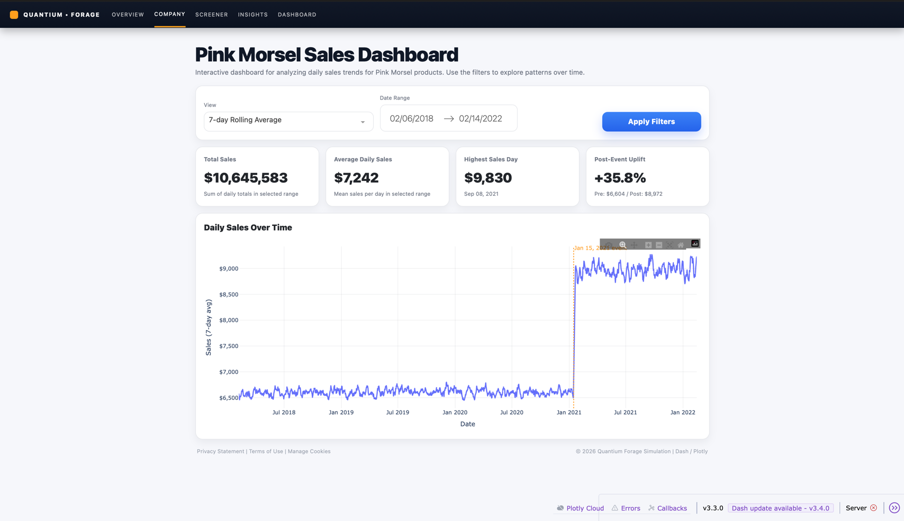

# Quantium Software Engineering Job Simulation — Dash Analytics Dashboard

Hi! I’m **Christiana T. Lawal**, and this repository contains my work for the **Quantium Software Engineering Job Simulation** hosted on **Forage**.
Founded in 2002, Quantium has a long history of innovation in data science across all sectors of the economy. 
As a rapidly growing global leader in data science and AI, they are dedicated to harness the power of data to drive 
revolutionary change that benefits us all and deliver the best results for their clients. 

This project simulates the role of a software engineer supporting data, financial and analytics teams at Quantium. It 
spans the full lifecycle of a small but realistic selling product, "Pink Morsels Candy Bar" from environment setup and 
data processing to building, styling, and deploying an interactive dashboard used to answer a concrete business question.

Rather than treating this as a one-off coding task, I approached the simulation as I would a real engineering project: 
prioritizing clean architecture, reproducibility, thoughtful UI design, and clear communication between data, product, 
and engineering concerns.

---

## Project Overview

The goal of this project is to build a **production-ready analytics dashboard** in Python that answers a real stakeholder 
question for our client "Soul Foods" who has unfortunately seen a decline in sales on their top performing candy product:

> **“Were sales higher before or after the Pink Morsel price increase on January 15, 2021?”**

To help Quantium support Soul Foods in understanding the impact of their decisions on profitability, 
I designed and implemented a data pipeline and visualization layer using:

* **Pandas** for data processing and transformation
* **Dash & Plotly** for interactive data visualization
* **Python virtual environments** for reproducible development
* **Gunicorn** for production-style serving
* **Git & GitHub** for version control and documentation

The final result is a clean, intuitive dashboard that allows a user to:

* View daily sales trends over time
* Clearly see the pricing event date Januraury 15, 2021
* View key performance indicators (KPIs) summarizing business impact.
* Interact with the data through date filters and User Interactive controls

---

## Engineering Mindset & Approach

This simulation mirrors how software engineers at Quantium collaborate with data teams:

* **Data engineering**: transforming raw transactional data into a clean, analytics-ready dataset for data scientist 
and financial analysts alike
* **Software engineering**: structuring code for cleanliness, efficiency, readability, reuse, and deployment
* **Frontend engineering**: designing a UI that makes insights obvious to non-technical stakeholders
* **Product thinking**: keeping the original business question front-and-center at every step while contributing to the 
design and architecture of new features and systems.

Throughout the project, I focused on:

* Writing clean, efficient, commented, and reusable  Python code
* Crafting features incrementally and testing each step while using Generative AI tools such as ChatGPT for research, 
data insights, and general productivity
* Treating environment setup and dependency management as first-class engineering tasks
* Designing UI components that feel professional, intuitive, and goal driven

---

## Task Breakdown

### Task 1 — Local Setup & Environment Configuration

The first task focused on setting up a **professional development environment**, similar to what would be expected on a real engineering team.

**Key steps completed:**

* Forked and cloned the Quantium starter repository
* Created and activated a Python virtual environment (`.venv`)
* Installed and managed dependencies using `pip` and `requirements.txt`
* Configured a clean `.gitignore` to exclude local artifacts
* Verified the environment by running basic imports and checks
* Committed and pushed all setup work with clear, descriptive commit messages

This task reinforced the importance of **reproducibility, isolation, and environment hygiene**, which are critical for 
both data and software engineering methodoligies and help everyone on the team to stay on the same page.

---

### Task 2 — Data Processing & Transformation

In this task, I worked with three raw CSV files containing transactional sales data across products, regions, and dates.

The raw data was intentionally messy and not immediately suitable for analysis. The data in these three files contained
several columns procudt, price, quantity, date region, etc all telling a story that was too broken to understand without cleaning up and organizing 
the raw data

**Data engineering ETL steps performed:**

* Loaded all three datasets and combined them into a single unified table
* Filtered the data to include **only Pink Morsel products**
* Calculated a new `sales` field by multiplying quantity × price
* Preserved `date` and `region` fields for downstream analysis
* Standardized date formats and ensured correct sorting
* Output a clean, analytics-ready dataset (`outputfile.csv`)

This step transformed raw data into **useful human speakable information**, creating a clear contract between the data pipeline and the visualization layer.

---

### Task 3 — Dash Application & Data Visualization

Using the processed dataset from Task 2, Under my supervisor Blaise I created an interactive dash app using **Dash** and **Plotly**.

**Core dashboard features:**

* A clear header and subtitle describing the purpose of the visualizer 
* A line chart visualizing total daily sales over time
* Properly labeled axes for readability and interpretation
* Automatic sorting by date to ensure chronological accuracy
* A visible event marker highlighting January 15, 2021 (price increase)

The dashboard though simple is focused, visualizing the data in an informative way that answers our clients question.

---

### Task 4 — UI Design, Styling & User Experience

In Task 4, I focused on elevating the dashboard from “functional” to **polished and user experience friendly**.

**Enhancements included:**

* Custom layout and spacing to improve readability and eye focus
* Styled KPI cards to surface high-level metrics at a glance so the user doesnt have to work too hard
* Date range filtering to support further exploratory analysis, what did the data look like before the price increase, 
after the price increase, what do sales look like per region, whats the 7 day rolling average?
* Unified hover behavior and clean visual defaults
* A professional, analytics-inspired aesthetic inspired by real Quantium dashboards

This task emphasized that **data products are used by humans**, and that good engineering includes empathy for the end user whether it be a Soul Food's representative, data analyst, financial analyst, or consumer .

---

## Technologies Used

* **Python 3.11**
* **Pandas**
* **Dash**
* **Plotly**
* **Dash Bootstrap Components**
* **Gunicorn**
* **Git / GitHub**
* **Virtual Environments**

---

## Running the Project Locally

```bash
# Clone the repository
git clone https://github.com/christianalawalj/quantium-software-engineering-dash-dashboard.git

# Enter the project directory
cd quantium-software-engineering-dash-dashboard

# Create and activate a virtual environment
python3 -m venv .venv
source .venv/bin/activate   # macOS / Linux

# Install dependencies
python -m pip install --upgrade pip
python -m pip install -r requirements.txt

# Run the Dash app locally
python app.py
```

For production-style serving:

```bash
gunicorn app:server
```

---

## Repository Structure

```bash
quantium-software-engineering-dash-dashboard/
│
├── app.py                 # Dash application
├── outputfile.csv         # Cleaned dataset from Task 2
├── requirements.txt       # Project dependencies
├── .gitignore             # Ignored files & folders
└── .venv/                 # Virtual environment (not committed)
└── data                # Three data csv files used in project
└── task2_data_processing.py # python file that cleans loads and transforms dataset into output file
```

---

